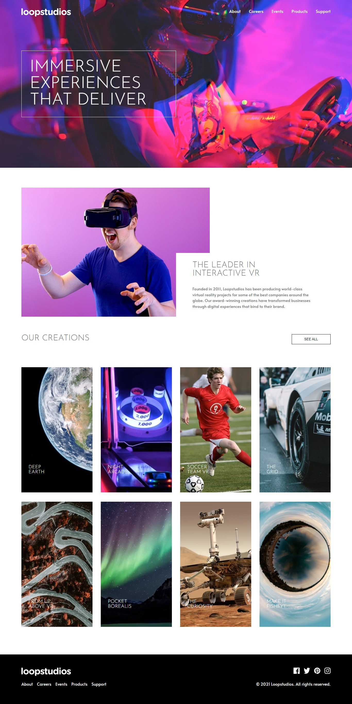
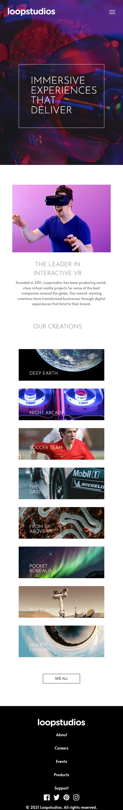

# Frontend Mentor - Loopstudios landing page solution

This is a solution to the [Loopstudios landing page challenge on Frontend Mentor](https://www.frontendmentor.io/challenges/loopstudios-landing-page-N88J5Onjw). 

## Table of contents

- [Overview](#overview)
  - [The challenge](#the-challenge)
  - [Screenshot](#screenshot)
  - [Links](#links)
- [My process](#my-process)
  - [Built with](#built-with)
  - [What I learned](#what-i-learned)
  - [Continued development](#continued-development)

## Overview

### The challenge

i developed the design for users to View the optimal layout for the site depending on their device's screen size and See hover states for all interactive elements on the page

### Screenshot

### Links

- Solution URL: https://github.com/oluwakolade/frontend-mentor---loopstudios-landing-page
- Live Site URL: https://loopstudios-landing-page-fronendmentor.vercel.app/

## My process

### Built with

- Semantic HTML5 markup
- CSS custom properties
- Flexbox
- CSS Grid
- javascript

### What I learned

i learnt how to work with relative and absolute position,i also learnt how to use css grid and the best way to make a mobile navigation work with javascript

### Continued development

i need to improve more on my semantic HTML, css layouts,mobile responsiveness and javascript

